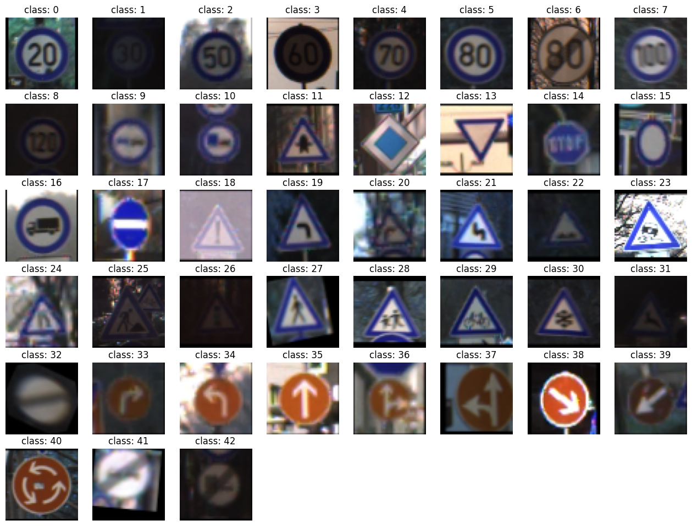

# Traffic Sign Classification Project

## 1. Overview

This project involves building a Traffic Sign Classification system using deep learning. The project leverages a pre-trained **VGG16 model**, along with data augmentation and preprocessing techniques, to classify traffic signs into **43 categories**.

The dataset can be found here: [German Traffic Sign Dataset](https://www.kaggle.com/meowmeowmeowmeowmeow/gtsrb-german-traffic-sign)

---

## 2. System Specifications

The hardware used to build and test the models:
- **GPU**: NVIDIA GeForce RTX 2080 Ti
- **CUDA Version**: 12.7
- **Tensorflow  Version**: 12.7

Key software and libraries:
- TensorFlow and Keras were used to access the VGG16 network and construct the final layers of the CNN.
- Visual Studio Code (Jupyter Extension)

---

## 3. Dataset

The dataset consists of **43 traffic sign classes**. The dataset is imbalanced, with some classes having fewer images than others. Data augmentation was used to address this imbalance.

### Dataset Details:
- **Total Classes**: 43
- **Class Imbalance Before Augmentation**:

- **Class Balance After Augmentation**:

---

## 4. Data Preprocessing

Steps:
1. **Normalization**: Images were normalized to have pixel values between 0 and 1.
2. **Augmentation**: Random transformations were applied (e.g., rotation, cropping) to balance the dataset.
3. **One-Hot Encoding**: Class labels were converted to one-hot encoded vectors.

### Dataset Preview:

---

## 5. Model

### Model Architecture:
- **Base Model**: Pre-trained **VGG16** (transfer learning)
- **Additional Layers**:
  - Batch Normalization
  - Fully Connected Layers
  - Dropout for regularization
  - Softmax activation for multi-class classification

**Model Summary**:

### Training:
- **Optimizer**: Adam
- **Loss Function**: Categorical Crossentropy
- **Training Duration**: Approximately 5 minutes per epoch on GPU

**Training Progress**:

---

## 6. Results

### Evaluation Metrics:
- **Test Accuracy**: 95.45%
- **Test Loss**: 0.1557

**Test Results**:

---

## 7. Device Specifications

**Hardware Used**:

**Software Versions**:

---

## 8. Conclusion

The Traffic Sign Classification system achieved high accuracy and demonstrated strong generalization on unseen test data. Using a pre-trained VGG16 model and balancing the dataset with augmentation proved to be effective strategies for this problem.

For further exploration, other models or additional preprocessing steps could be considered to push performance even further.

---

## 9. References

- Dataset: [German Traffic Sign Dataset](https://www.kaggle.com/meowmeowmeowmeowmeow/gtsrb-german-traffic-sign)
- VGG16 Model: [Keras Applications Documentation](https://keras.io/api/applications/)
- TensorFlow Documentation: [TensorFlow](https://www.tensorflow.org/)
- OpenCV Library: [OpenCV](https://opencv.org/)
- ImgAug for Augmentation: [ImgAug Documentation](https://imgaug.readthedocs.io/)
